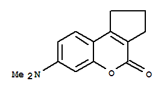

Solvent effects are sum of the bulk solvent properties like polarity, dielectric property, dispersive-induction-polarization interactions, viscosities and/or specific solute-solvent interactions. In the absence of inter-molecular hydrogen bond, the spectral shifts are mainly sensitive to the solvent polarity. Solvent-solute interactions in the cases of non-polar solvents like saturated hydrocarbons are negligible. Therefore, the absorption spectrum of a solute molecule in these nonpolar solvents shows fine spectral details similar to that in pure gaseous state.  

We know that the electronic transitions modify the charge distribution of the absorbing molecule. Therefore, depending on the solvent polarity and kind of transition, solvent-solute interactions vary which in turn determine the energies of the ground and excited states of the light absorbing molecule. This affects both the peak position (λ max ) and absorptivity (ε) of the absorbing molecule. The absorptivity, a characteristic of the absorbing substance, is a useful quantity that gives us idea about the transition probabilities in the molecules and the effective light capture area (the cross-section for light absorption) of the species. If the chromophore involved in the transition is more polar in its ground state than in its excited state, then the ground state is more stabilized than the excited state by a more polar solvent due to solvation. Chromophores with n→π * or n→σ * transitions exhibit such behavior. The solvent molecules are oriented around the solute (chromophore) molecules to fit with the ground state charge distribution of the solute molecules. Hydrogen bonding or polar solvents interact more strongly with unshared electron pairs of the ground state molecule. On excitation, the charge distribution in such systems changes markedly and therefore, the solvent molecules would not have position and orientation to interact with the excited state charge distribution. Thus, the ground state of such solute molecules are more stabilized than the excited state. This widens the energy gap between the ground and excited states with increasing polarity of the solvents (Figure 1). Therefore, more energy is required for the n→π*kind of electronic transition with increasing solvent polarity. This results in the shift of spectral peak positions towards shorter wavelength. On the other hand, if the excited state of the chromophore is more polar with respect to the ground state, then the excited state will be more solvated and more stabilized by a more polar solvent. This kind of property is observed in the case chromophores with π →π* transitions. The π electron density is equally distributed in the ground state and the C nuclei are shielded whereas in the π* excited state the C nuclei become electron deficient due to the electron promotion. This favors stronger interaction of the excited state molecule with more polar or hydrogen bonding solventsand thereby stabilizing the excited state more than the ground state. This decreases the energy gap between the excited and the ground states with increasing solvent polarity (Figure 1) which results in shift of absorption peak positions towards longer wavelengths. We may recall that a shift of the absorption peak position (λ max ) towards shorter wavelengths is called a blue shift or hypsochromic effect. On the other hand, a shift of the λ max towards longer wavelength is termed as the red shift or bathochromic effect. When there is an increase in the absorption intensity,(i.e., absorbance) the effect is termed as hyperchromic effect. If there is a decrease in the absorption intensity, the effect is termed as hyporchromic effect.  

Figure1: Effect of solvent polarity on n→π* and π →π* transitions.  

The solvent dependent spectral shifts that originate from the interaction between the chromophore and the entire set of surrounding solvent molecules and do not involve any chemical interactions or specific solvent-chromophore interactions are referred to as "general solvent effects". In such cases, the energy between the ground state and excited state is affected by the dipole interaction between the solvent and the chromophore which is function of the solvent refractive index and dielectric constant. Taking only the continuum dielectric properties (the dielectric constant and the refractive index) as a measure of the solvation energy, energy of absorption or λmax is found to be related to the solvent polarity function, ∆f. The polarity function can be calculated from

\begin{equation} ∆f = [(D-1)/(2D+1)] - [(n^2 - 1)/(2n^2 + 1)] \end{equation} where D is the dielectric constant and n is the refractive index of the solvent. Here absorptions of coumarin138have been studied in a number of polar and nonpolar solvents, namely cyclohexane, dioxane, acetonitrile, ethanol and ethylene glycol, to demonstrate the solvent effect.

Figure 2: Molecular structure of coumarin138.

Table 1. Solvent properties and maximum absorbances and corresponding absorption wavelengths (λmax) of coumarin138.

|Solvent|Refractive Index (n)|Dielectric Constant (D)|∆ f|Abs at λmax|λmax(nm)|
|-------|--------------------|-----------------------|---|----------------------|-------------------|
|Cyclohexane|	1.424        |		2.01         |   |                      |                   | 
|Dioxane    |   1.420        | 		2.21         |   |                      |                   |
|Acetonitrile|  1.342        |    	35.94        |   |                      |                   |
|Ethanol     |  1.359        |		23.40        |   |	                |                   |
|Ethylene Glycol|1.429       | 		38.69        |   |                      |                   |
	

	

	

